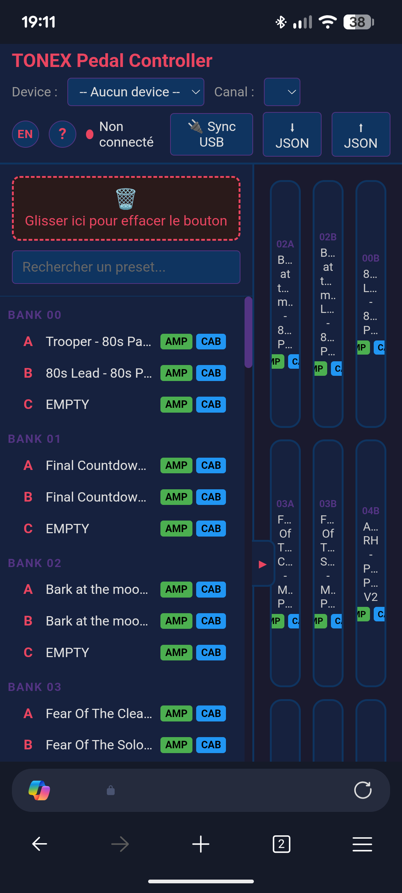
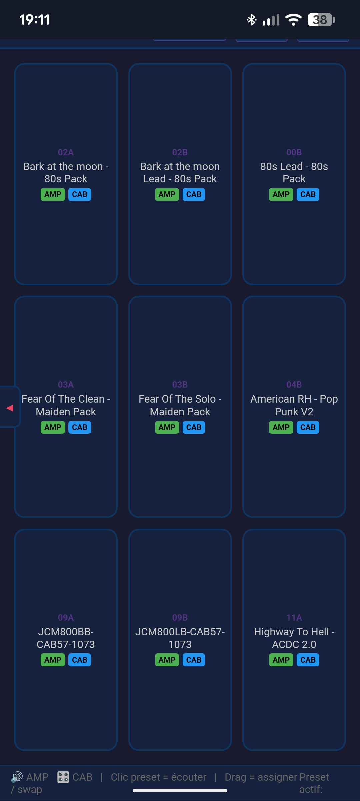

# TONEX Pedal Controller

Contrôleur web single-page pour l'IK Multimedia TONEX Pedal. Gère les presets via USB MIDI et lit les noms/configurations directement depuis le pédalier via l'interface série USB CDC.

Ordinateur :


Téléphone Android :




Démo vidéo PC :
[](https://www.youtube.com/watch?v=ZrpM73ms7fk)

Démo vidéo Android :
[](https://www.youtube.com/watch?v=XhKJ70A9dGQ)

## Fonctionnalités

- **Grille 3×3** de presets assignables avec noms et badges AMP/CAB
- **Bibliothèque complète** des 150 presets (50 banks × 3 slots A/B/C)
- **Synchronisation USB** — lecture de tous les noms et flags AMP/CAB directement depuis le pédalier
- **Contrôle MIDI** — envoi de Bank Select + Program Change pour changer de preset
- **État temps réel fiable** — distingue les presets demandés, acceptés par le pont, confirmés par la pédale, expirés et périmés
- **Reprise de connexion** — affiche l'état du pont, de la pédale et de la bibliothèque, puis se reconnecte après une interruption réseau ou USB
- **Glisser-déposer** — assigner un preset à un bouton, swap entre boutons, ou supprimer via la corbeille
- **Édition** — double-clic pour renommer un preset et toggler AMP/CAB
- **Recherche** filtrante dans la bibliothèque
- **Persistance** — configuration sauvegardée en localStorage
- **Responsive** — texte adaptatif via `container-type: inline-size` + unités `cqi`
- **Bascule bibliothèque** — chevron discret pour minimiser/étendre la bibliothèque de presets
- **Export/Import JSON** — exporte les noms de presets vers un fichier, importe sur une autre config
- **Support Android** — fonctionne sur Android Chrome via fallback WebUSB (Web Serial non disponible sur Android)
- **Pont Sans Fil (ESP32-S3)** — contrôle à distance autonome en Wi-Fi depuis Safari iOS ou tout navigateur LAN, sans aucun ordinateur requis

## Prérequis

| Composant | Version requise |
|-----------|----------------|
| Navigateur | Chrome 89+ ou Edge 89+ (Web MIDI + Web Serial API) ou Safari iOS (via Pont ESP32) |
| Système | Windows 10/11, Android (via WebUSB), iOS / macOS (via Pont ESP32) |
| Pédalier | IK Multimedia TONEX Pedal (full size) |
| Câble | USB-C connecté au port USB du pédalier |

> **Note** : L'API Web Serial nécessite HTTPS ou localhost. Servir via un serveur web local (ex: `https://mon-serveur/tonexpedal/`) ou `localhost`.

> **Note Android** : Sur Android, Web Serial n'est pas disponible — l'application utilise le fallback WebUSB pour la communication USB CDC. Le MIDI n'est pas disponible sur Android (pas d'API Web MIDI).

## Installation & Déploiement

### Option 1 — Serveur web local (recommandé pour PC)

Copier le dossier `tonexpedal/` dans le répertoire racine de votre serveur web, puis accéder via :
```
https://mon-serveur/tonexpedal/
```

### Option 2 — localhost avec un serveur simple

```bash
# Depuis le dossier tonexpedal/
npx serve -s . -l 3000
# ou
python -m http.server 3000
```

Puis ouvrir `http://localhost:3000`.

### Option 3 — Fichier statique (sans serveur)

Simplement double-cliquer sur `index.html` ou l'ouvrir via `file:///` dans votre navigateur.

### Option 4 — Pont Sans Fil Autonome (ESP32-S3)

Pour contrôler la pédale depuis Safari iOS (iPad/iPhone) sur le canapé ou sur scène sans aucun PC allumé :
1. Copier `firmware/include/wifi_secrets.example.h` vers `firmware/include/wifi_secrets.h` et renseigner les identifiants du WLAN existant.
2. Flasher le firmware et les données LittleFS situés dans [`firmware/`](firmware/) sur une carte **ESP32-S3-DevKit** ([Exemple Amazon](https://www.amazon.com/dp/B0GBT212KM)).
3. Imprimer en 3D un boîtier clipsable ([Modèle 3D Printables](https://www.printables.com/model/1774744-case-for-yd-esp32-s3-n16r8)).
4. Connecter l'ESP32 à la ToneX Pedal en USB et l'alimenter en 5V (ou via une dérivation 9V).
5. Relever l'adresse DHCP dans le journal série, puis ouvrir cette adresse ou `http://tonex.local` depuis un navigateur connecté au même WLAN.

Voir le guide complet : [Documentation du Pont Sans Fil ESP32-S3](docs/ESP32_WIRELESS_BRIDGE_fr.md).

## Utilisation

### Connexion MIDI

1. Brancher le TONEX Pedal en USB
2. Ouvrir l'application dans Chrome/Edge
3. Sélectionner le device MIDI dans le menu déroulant **Device**
4. Choisir le canal MIDI (défaut : Ch 1)
5. Le statut passe à **Connecté** (point vert)

### Synchronisation USB (lecture des presets)

1. Cliquer sur **Sync USB**
2. Sélectionner le port série TONEX Pedal dans le dialog
3. La progression s'affiche : Hello → State → Lecture des 150 presets
4. Les noms et badges AMP/CAB se remplissent automatiquement
5. Le bouton affiche **Terminé! X/150 presets lus**

### Export / Import JSON

- Cliquer sur **⬇ JSON** pour télécharger les noms de presets en `tonex-presets.json`
- Cliquer sur **⬆ JSON** pour importer un fichier exporté (valide le format, remplace les noms)

Format JSON :
```json
{
  "0_A": "Trooper - 80s Pack",
  "0_B": "80s Lead - 80s Pack",
  "1_A": "Final Countdown - 80s Pack"
}
```

### Grille 3×3

- **Clic simple** sur un bouton → envoie le Bank Select + Program Change au pédalier
- **Glisser** un preset de la bibliothèque → assigne au bouton
- **Glisser** un bouton vers un autre → swap les positions
- **Glisser** un bouton vers la corbeille → vide le bouton
- **Double-clic** → ouvre le modal d'édition (nom, AMP, CAB)

### Bibliothèque

- **Clic simple** → envoie le MIDI pour écouter le preset
- **Double-clic** → édite le nom et les flags AMP/CAB
- **Recherche** → filtre par nom ou numéro de bank/slot
- **Glisser** vers la grille → assigne le preset
- **Chevron** (▶/◀) sur la bordure du panneau → minimise/étend la bibliothèque

## Architecture technique

### Fichiers

```
tonexpedal/
├── index.html                     # Application SPA principale (détecte Web MIDI/Série vs Pont WebSocket)
├── favicon.svg                    # Icône SVG
├── package.json                   # Scripts de test et métadonnées
├── README.md                      # Documentation en anglais
├── README_fr.md                   # Cette documentation en français
├── docs/
│   ├── index.html                 # Page de documentation web (FR/EN)
│   ├── ESP32_WIRELESS_BRIDGE.md   # Guide technique ESP32 (EN)
│   └── ESP32_WIRELESS_BRIDGE_fr.md# Guide technique ESP32 (FR)
├── captures/
│   └── tnx1.png                   # Capture d'écran de l'interface
├── firmware/                      # Firmware PlatformIO autonome pour ESP32-S3
│   ├── platformio.ini             # Config de build pour ESP32-S3 et tests natifs
│   ├── partitions_16MB.csv        # Carte des partitions flash LittleFS
│   ├── include/                   # En-têtes C++ (HDLC, USB Host, pont WebSocket)
│   ├── src/                       # Fichiers sources C++
│   ├── test/                      # Tests unitaires C++ Unity
│   └── data/                      # Fichiers web LittleFS
└── tests/                         # Suites de tests unitaires JavaScript / Protocole
    ├── protocol.test.js           # Tests CRC-CCITT, byte-stuffing, décodage binaire
    ├── midi.test.js               # Tests de conversion Bank/PC
    └── import_export.test.js      # Tests de validation du schéma JSON
```

### Développement & Tests

Lancer la suite de tests unitaires JavaScript :
```bash
npm test
```

Lancer les tests unitaires C++ natifs (PlatformIO) :
```bash
python3 -m pip install -r requirements-dev.txt
cd firmware && pio test -e native
```

La cible ESP32 utilise PlatformIO Espressif32 7.0.1 avec une configuration N16R8 explicite (16 Mo de flash et 8 Mo de PSRAM octale).

Pour la validation matérielle USB directe et la capture de diagnostic optionnelle, consultez la [checklist de test matériel TONEX](docs/TONEX_HARDWARE_TEST_CHECKLIST.md).

Sous macOS, lorsque l'index du preset actuel est connu, validez les changements MIDI rapides et leurs confirmations CDC tout en restaurant ensuite ce preset :

```bash
npm run hardware:midi-stress -- --restore-index 0
```

Par défaut, le test envoie 150 changements à 5 Hz pendant 30 secondes. Il échoue en cas d'événement manquant, excédentaire, désordonné, mal formé ou doté d'un CRC invalide, et exige que CDC confirme l'index restauré final. Cette commande change le preset audible ; réduisez le volume des moniteurs avant de l'exécuter.

Pour capturer des empreintes CDC horodatées pendant le test d'une commande physique de la pédale, exécutez :

```bash
npm run hardware:control-capture -- --label footswitch_b --seconds 20
```

L'enregistreur affiche les événements en direct et limite les messages longs aux métadonnées structurelles, à une empreinte de hachage et à un court préfixe. Il n'expose ni les noms des presets ni leurs paramètres.

Pour interroger la réponse State courte et, facultativement, calculer l'empreinte d'un preset actif connu pendant un test de bypass :

```bash
npm run hardware:state-watch -- --seconds 30 --preset-index 0
```

La pédale accepte le contrôle du bypass du preset via le CC MIDI 12 (`0` = bypass, `127` = actif), testable avec une sonde qui restaure l'état actif :

```bash
npm run hardware:midi-cc-probe -- --controller 12 --values 0,127 --restore-value 127
```

### Protocole MIDI

Le TONEX Pedal utilise 50 banks × 3 slots (A/B/C) = 150 presets.

| Preset # | Bank Select (CC#0) | Program Change |
|----------|-------------------|----------------|
| 0–127    | CC#0 = 0          | PC = preset#   |
| 128–149  | CC#0 = 1          | PC = preset# − 128 |

```
Bank Select : [0xB0 + channel, 0x00, value]
Program Change : [0xC0 + channel, PC]
```

### Protocole USB CDC Série (HDLC)

Le pédalier expose deux interfaces USB :
- **USB-MIDI** — pour les Bank Select / Program Change
- **USB CDC** — pour la communication série (lecture presets, paramètres)

#### Trame HDLC

```
[0x7E] [payload stuffed] [CRC_lo stuffed] [CRC_hi stuffed] [0x7E]
```

- **Délimiteur** : `0x7E`
- **Byte stuffing** : `0x7E` → `0x7D 0x5E`, `0x7D` → `0x7D 0x5D`
- **CRC-CCITT** : polynomial `0x8408`, init `0xFFFF`, résultat inversé (`~crc & 0xFFFF`)

#### Commandes

| Commande | Payload | Description |
|----------|---------|-------------|
| Hello | `b9 03 00 82 04 00 80 10 01 b9 02 02 10` | Initialisation connexion |
| Request State | `b9 03 00 82 06 00 80 10 03 b9 02 81 01 02 10` | Demande l'état courant |
| Request Preset (0–127) | `b9 03 81 00 02 82 06 00 80 10 03 b9 04 10 01 [index] 00` | Demande preset (17 octets) |
| Request Preset (128+) | `b9 03 81 00 02 82 06 00 80 10 03 b9 04 10 01 80 [index] 00` | Demande preset (18 octets, escape `0x80`) |

#### Réponse preset — Structure

```
[header] [B9 04 B9 02 BC 21] [nom 33 octets] [paramètres...]
                                           ↑ NAME_MARKER
```

La section paramètres commence par le marker `BA 03 BA 29` (`PARAM_MARKER`), suivi de floats encodés `0x88` + 4 octets (little-endian) :

| Index paramètre | Octet offset (×5) | Description |
|----------------|-------------------|-------------|
| 17 | 85 | **AMP Enable** — 0.0 = off, >0.5 = on |
| 23 | 115 | **CAB Type** — 0.0 = Tone Model, 1.0 = VIR, 2.0 = désactivé |

### Device ID

- **TONEX Pedal (full size)** : `0x10`
- TONEX One : `0x0B` (non supporté)

### Abstraction de transport (Support Android)

L'application utilise une couche d'abstraction de transport pour supporter à la fois **Web Serial** (desktop) et **WebUSB** (Android) :

```
transportSend(frame)      → Serial.write() ou USB.bulkTransferOut()
transportStartRead()      → boucle reader Serial ou boucle USB.bulkTransferIn()
transportIsOpen()         → serialPort.opened ou usbDevice.opened
transportDisconnect()     → serialPort.close() ou usbDevice.close()
```

**Flux de connexion :**
1. Essayer **Web Serial** en premier (desktop Chrome/Edge)
2. Si non disponible ou échec, fallback vers **WebUSB** (Android Chrome)
3. WebUSB affiche le sélecteur de device filtré par VID `0x1963` (IK Multimedia)

**Configuration WebUSB CDC :**
- Trouver l'interface CDC Communication (classe `0x02`) → control transfers (SET_LINE_CODING, SET_CONTROL_LINE_STATE)
- Trouver l'interface CDC Data (classe `0x0A`) → bulk endpoints pour les données HDLC
- Si la classe `0x0A` n'est pas trouvée, fallback sur toute interface avec des bulk endpoints

### Persistance

Tout est sauvegardé en `localStorage` sous la clé `tonex-state` :

```json
{
  "buttons": {
    "0": { "bank": 0, "slot": "A" },
    "4": { "bank": 1, "slot": "B" }
  },
  "midi": { "device": "ToneX MIDI Out", "channel": 0 },
  "presets": {
    "0_A": { "name": "Trooper - 80s Pack", "amp": true, "cab": false },
    "0_B": { "name": "80s Lead - 80s Pack", "amp": true, "cab": true }
  }
}
```

## Dépannage

| Problème | Solution |
|----------|----------|
| Aucun device MIDI | Vérifier que le pédalier est branché. Chrome → `chrome://midi-devices` |
| Web Serial non disponible | Utiliser Chrome 89+ ou Edge 89+. Vérifier HTTPS/localhost |
| Sync USB échoue | Fermer tout autre logiciel utilisant le port série (IK Tonex, etc.) |
| Noms ne s'affichent pas | Relancer le Sync USB. Vérifier la console (F12) pour les erreurs |
| AMP/CAB toujours gris | Vérifier dans la console que les float32 sont correctement lus |
| Canvas vide | Recharger la page, le localStorage peut être corrompu |
| Android : Sync ne lit pas les données | Le fallback WebUSB devrait s'activer automatiquement. Vérifier les logs d'interface/endpoint dans la console |

## Crédits

- Protocole USB CDC : reverse-engineered depuis [Builty/TonexOneController](https://github.com/Builty/TonexOneController)
- Documentation protocole : [vit3k/tonex_controller](https://github.com/vit3k/tonex_controller)
- Interface : IK Multimedia TONEX Pedal Controller v1.1

## Licence

Projet personnel — usage non commercial.
